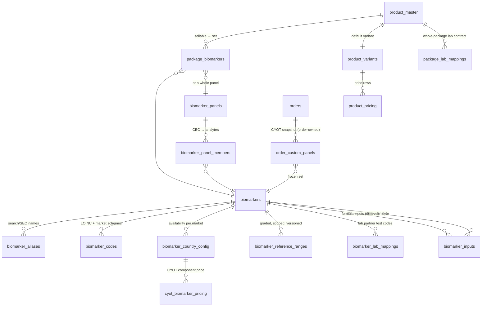

# Biomarker & test-package data model — design plan

**Status: PLANNING ONLY — awaiting review.** No code, migrations, DDL or admin UI ship with this document.

**Inputs read in full:**
- Legacy reference codebase `/Users/ritwik/valeo-projects/Admin-Panel` (NIMDA, master @ `e54bdab7f`)
- `./biomarkers.csv` — 494 rows, exported from the Google Sheet **"Valeo Active Biomarkers"** (Drive id `1rgDizytBkA376HkE-ZtBSRH7VOM7ffQRk1BiDNxgrYQ`, owner ritwik.gupta@feelvaleo.com). *Assumption A1: this is the intended master list — no `biomarkers.csv` existed locally, so it was located in Drive by content match and exported. Two sibling sheets ("Biomarker details" — per-package ranges; "Biomarker Sheet" — unmapped biomarkers per blood package) corroborate but were not treated as masters.*
- The new-CMS schema baseline: **"Schema Cleanup.docx"** (25-table catalogue reference, 2026-08-17) — `product_master`, `product_variants`, `product_pricing`, `translations`, `departments`, etc. The biomarker model below is designed to *join* that schema, not to invent a parallel one.
- **"Custom Test 2026"** (Sheets id `1O3HiXZmjWvevSsM20CR79m4xib6rAbVeX4cvZySnanM`, read via service account) — the live lab-partner price book: 40 tabs of per-lab test codes, B2B costs, TATs and sample details across ~15 labs (Unilabs, Alborg, Medlab, Genalive KSA, Almostaqbal…). This is the operational reality behind lab routing and CYOT costing, and it corrected the first draft in five places (§1.4).

---

## 1. Current state (grounded in the repo)

### 1.1 The biomarker record

Authored in `src/pages/Packages/ManageBioMarkers.jsx` via `src/services/BiomarkServices.js` (`biomarkers/` REST endpoint). What a biomarker actually is today (state at `ManageBioMarkers.jsx:109-163`, payload at `:730+`):

| Legacy field | Notes |
|---|---|
| `name`, `name_ar` | display names |
| `about_test`, `cause_test`, `control_test` (+`_ar`) | clinical content (what/why-high-low/what-to-do) |
| `unit` | free-text string; **`BiomarkerUnitConversion.jsx`** holds ad-hoc conversions |
| `test` | **parent test id — a biomarker belongs to exactly one "test" (panel)** (`ManageTests.jsx`) |
| `image` | icon |
| `selectedCountry` | **the whole biomarker is saved per country**: `saveBiomarker(biomarkers, countryId)` (`BiomarkServices.js:8`) |
| `arrMaleBioMarkRange` / `arrFemaleBioMarkRange` | per-sex arrays of `{status_name, status_name_ar, range_start, range_end, color}` (`BioMarkForm.jsx`) |
| `is_biomarker_multiple_ranges`, `is_biomarker_gender_segregation`, `isOptimalRangeMale/Female` | shape flags |

**Not found in repo:** LOINC, UCUM, NABIDH/Riayati/NPHIES, any code-system field, specimen/tube type, analytical method, fasting-per-biomarker, TAT-per-biomarker, derived-vs-measured flag, versioning of ranges. (Grep across `src/` — the only "loinc" hit is a timezone string.) Fasting and result-time exist only at **package** level (`AddPackagesForm.jsx`: `result_time`, `result_time_arabic`).

### 1.2 Sellable surfaces

- **Mini Package** — an order-item type (`OrderItemType.js:45-47`, `Mini_Package`) and internal category (`InterenalCategory.js:18-20`), with per-city pricing/update flows (`constant.js:44-45`, `PackageCityDetails.jsx`). This is the wrapper that makes a single biomarker orderable.
- **Blood Test Package** — a combination of biomarkers (`BloodBiomarkerPackages.jsx`, `PackagesCMS.jsx`, `AddPackagesForm.jsx`).
- **CYOT** — the `create-your-own-test` page; per the CYOT PRD (Drive, "PRD: Create Your Own Test Revamp & Migration"): *"resolve recommended categories/tags → mini packages active + priced in the user's city → pre-add to cart"*. **CYOT's selectable unit today is the mini package, not the biomarker.**

  ⚠️ **CORRECTION (2026-09-02, from reading the legacy code rather than the PRD).** An earlier draft of this doc claimed "one mini package exists per individual biomarker". That is **wrong**, and the error mattered:
  - The field labelled "Biomarker List\*" on a mini package is `SelectTests` — a react-select with `isMulti={true}` over `GET /tests`. It holds **test ids, not biomarker ids**, and a mini package wraps a **set** of them (`MiniPackages.jsx`, `SelectTests.jsx`).
  - **No biomarker id appears in any commerce row anywhere.** Packages, mini packages, carts, coupons, lab costs and search documents all carry test ids. There is no test→analyte expansion step in the system.
  - CYOT price is computed client-side by `findMiniPackageItemPrice`: a **plain sum** over the selected mini packages, with **no deduplication** — two selections sharing a test are both charged in full today.
  - The merchandised/searchable unit is the **mini-package-city row**, not the mini package: the post-save hook POSTs one search document per city row with that row's own price.

  Consequences for this plan, carried through below: component prices **cannot** be seeded from mini-package city prices (§2.11 step 6), no price-parity check is possible at cutover, and the programme is a catalogue **data-construction** effort — a test→analyte expansion plus a component price per analyte per market, authored from nothing — not only a schema change.
- **Custom test add-ons** (`CustomTestAddOns/*`) — country + image + status + city pricing; the attach-on-top-of-a-package flow.

### 1.3 What the CSV shows (data quality that shapes the model)

| Finding | Count | Consequence for the model |
|---|---|---|
| Rows | 494 | — |
| UAE-only / KSA-only / both | 296 / 58 / 140 | country-duplicated masters are real: the same clinical analyte exists as two rows when sold in two markets |
| Duplicate names | 8+ (e.g. "Platelet Count", "Copper", "ACTH", "Transferrin Saturation Index") | mostly the country duplication above; must be folded in migration |
| `status` column | holds **concatenated range blobs**, e.g. 12 overlapping graded ranges for Vitamin B12 (Deficiency/Minimal/Normal/Low/High/optimal, mixed casing, open-ended ranges) | ranges were flattened into display strings; several *generations* of ranges coexist with no versioning — the model must make range sets first-class and versioned |
| Sex flags | all 494 rows say Both | the *legacy admin* supports sex-segregated ranges, so sex-restriction lives in ranges today, not on the biomarker; the sheet lost it. Sex-restricted markers (PSA, Beta-HCG…) need a real field |
| Derived-looking (ratio/index) | 32 | ratios (TG/HDL, ApoB/ApoA1, FIB-4, NLR…) are computed, not drawn — need `derived` + formula inputs |
| Bilingual content | complete (0 empty AR descriptions) | EN/AR content exists for all 494 — migrates into `translations` |

### 1.4 What the lab price book adds (Custom Test 2026)

| Evidence (tab) | Fact | Consequence |
|---|---|---|
| `UAE_Master_Sheet` (1119 rows), `KSA_Master_Sheet` | **An internal biomarker code registry already exists**: `Valeo Code` `VB1001…` (UAE) and `VK1001…` (KSA) — two *separate country series* for what is often the same analyte | the master's `uid` absorbs both as legacy aliases; dedup (migration step 1) joins on these codes, not only on names |
| `Unilabs_Sample_Details` (1775 rows) | Per-lab, per-test: **CPT code** (populated), **LOINC column present but empty**, unit, methodology, sample type/volume/stability/temperature, TAT, **prescription-required**, **consent-required**, sex restriction | (a) **CPT joins the scheme list** — it is the one coding system already in live use; (b) empty LOINC confirms "not yet mapped" is the true starting state; (c) specimen volume/stability/temperature are **per-lab facts** — the biomarker master keeps the canonical specimen/tube, lab mappings carry the lab's own requirements; (d) two compliance flags the draft missed: `prescription_required`, `consent_required` |
| `UAE_Master_Sheet` price columns (Lifenity/Alborg/Unilab/Biosytech/Intel) | **Per-lab B2B cost per biomarker** — the cost side that `LabCostingNew.jsx` consumes | `biomarker_lab_mappings` gains `b2b_cost`; CYOT margin = component sell price − routed lab cost, both modelled, neither derived from the other |
| `Unilab_Prices till Mar2026` (the linked tab, 2944 rows) | Labs also price **whole Valeo packages** under their own codes (`VALCORP`, `VALEOAMP`…) with B2B price, TAT and volume-tier discount plans ("< 200, 15%; 200→1000, 20%…") | new entity **`package_lab_mappings`** `{product_id, lab_partner_id, country_id, lab_package_code, b2b_cost, tat_days, effective_from/to}` — a package can route as ONE lab order rather than N analyte orders, and costing is real, not summed |
| Multiple dated tabs per lab ("till Mar2026", "Start from Apr 2026", "2025"/"2026") | lab contracts are **effective-dated in practice** | confirms `effective_from/to` on both lab-mapping entities; migration ingests only the currently-effective tab per lab and archives the rest |

---

## 2. Proposed entity model

### 2.1 Principles

1. **A biomarker is a clinical fact, not a product.** It has no price, no SKU, no status beyond curation lifecycle. Sellability always belongs to a wrapper (`product_master` row).
2. **One row per analyte, worldwide.** Country variation is expressed by *scoped child rows* (availability, ranges, codes), never by duplicating the master — the 296/58/140 split migrates into one deduplicated master set with per-country availability.
3. **All display text lives in `translations`** (the new schema's own rule). No `_en`/`_ar` columns on any new table.
4. **Everything versioned that a clinician or regulator can ask "what did it say on date X?" about** — ranges and codes — via effective-dated rows, not overwrites.

### 2.2 ERD

### 2.3 `biomarkers` (master — one row per analyte)

| Field | Type | Notes |
|---|---|---|
| `id` | bigint PK | |
| `uid` | varchar UNIQUE | stable business key (slug-like), survives renames |
| `canonical_name` | — | **in `translations`** (`entity=biomarker, attr=name`); the column itself holds only an internal name for admin search |
| `internal_name` | varchar UNIQUE | admin-facing, EN, e.g. `vitamin_b12` |
| `specimen_type` | enum | `SERUM, PLASMA_EDTA, WHOLE_BLOOD, URINE, STOOL, SALIVA, SWAB, OTHER` — the CSV includes urine/stool rows ("Urine Analysis", "Stool Occult Blood"), so "blood biomarker master" already isn't blood-only |
| `tube_type` | enum, nullable | `SST_GOLD, EDTA_LAVENDER, CITRATE_BLUE, FLUORIDE_GREY, HEPARIN_GREEN, NONE` — nullable because non-blood specimens have no tube |
| `analytical_method` | varchar, nullable | e.g. CLIA, HPLC; free text until lab partners confirm a vocabulary |
| `result_unit_ucum` | varchar | UCUM code (`ng/mL`, `%`, `10*9/L`); display unit derives from it |
| `fasting_hours` | tinyint, nullable | NULL = no fasting; package fasting = MAX over members (derived, never typed on the package) |
| `tat_hours` | smallint, nullable | analyte-level TAT; package TAT = MAX over members per lab (see `biomarker_lab_mappings.tat_hours` override) |
| `sex_applicability` | enum | `ANY, MALE_ONLY, FEMALE_ONLY` — a *hard* restriction (PSA, Beta-HCG), distinct from per-sex ranges |
| `is_derived` | tinyint(1) | ratios/indices (32 in the CSV); a derived biomarker **must** have `biomarker_inputs` rows and **must not** have `biomarker_lab_mappings` |
| `lifecycle` | enum | `DRAFT, ACTIVE, DEPRECATED` — curation state, not sellability (there is none) |
| `content` | — | description / about / causes / what-to-do, EN+AR → `translations` (4 attrs × 2 langs; complete for all 494 rows) |
| `image_url` | varchar | icon (legacy `image`) |
| `created_at` / `updated_at` | timestamp | per the schema-cleanup conventions |

**`biomarker_aliases`** — `{biomarker_id, alias, language_code, kind: SEARCH|SEO|LAB_SYNONYM}`. Search ("HbA1c" vs "Haemoglobin A1c"), SEO landing terms, and lab report synonyms are one mechanism. Uniqueness on `(alias, language_code)` so one alias can't point at two analytes.

**`biomarker_panels` / `biomarker_panel_members`** — panel-vs-analyte, the relationship the legacy `test` FK forced into single-parent. CBC is a panel of ~20 analytes; a package includes *the panel*, results attach to *analytes*. Members: `{panel_id, biomarker_id, sort_order}`. A panel is not sellable either.

**`biomarker_inputs`** — `{derived_biomarker_id, input_biomarker_id, role}` for ratios/calculated LDL. Publish gate: a package containing a derived biomarker must also contain (or co-derive) all its inputs — TG/HDL without Triglycerides is unresolvable.

### 2.4 Ranges: `biomarker_reference_ranges` (versioned, scoped)

The CSV's single biggest lesson: ranges were flattened into strings, generations coexist, and nothing says which applied when. One row per graded band:

| Field | Notes |
|---|---|
| `biomarker_id` | FK |
| `country_id`, nullable | NULL = default; a market override wins (regulators do differ) |
| `lab_partner_id`, nullable | lab-specific ranges win over country (method-dependent ranges are real) |
| `sex` | `ANY, M, F` |
| `age_min_years`, `age_max_years`, nullable | paediatric/geriatric bands |
| `pregnancy` | `ANY, PREGNANT, NOT_PREGNANT` |
| `grade` | enum-ish vocabulary: `CRITICAL_LOW, LOW, SUBOPTIMAL, NORMAL, OPTIMAL, HIGH, CRITICAL_HIGH` + label in `translations` (the CSV's free-text "Minimal"/"Adequate"/"Diabetic Range" migrate as display labels; the enum drives logic) |
| `range_low`, `range_high` | decimal, either nullable (open-ended) |
| `effective_from`, `effective_to` | **versioning** — a new range generation closes the old rows, never deletes them |

Resolution order (fixed, first match wins): `(lab, country, sex, age, pregnancy)` → `(country, …)` → default. Same effective-row pattern the CMS already ships for slots and scopes.

### 2.5 Coding / EMR mapping: separate entity, not columns — `biomarker_codes`

**Options considered:**

| | A. Columns on `biomarkers` (`loinc_code`, `nabidh_code`, …) | B. Mapping entity keyed (biomarker, scheme, country, version) — **recommended** |
|---|---|---|
| New market/scheme | ALTER TABLE + release | insert rows |
| One biomarker, several codes in one scheme (method-specific LOINCs are common) | impossible | natural |
| Versioning (LOINC releases, NPHIES updates) | overwrite, history lost | effective-dated rows |
| "No LOINC match" | NULL is ambiguous (missing vs none-exists) | explicit `status: UNMAPPED_CONFIRMED` row distinct from *no row* = not yet mapped |
| Read cost | free | one indexed join, cacheable |

**`biomarker_codes`:** `{biomarker_id, scheme, country_id nullable, code, code_display, code_kind: FULL|PART, status: MAPPED|UNMAPPED_CONFIRMED|PENDING_REVIEW, effective_from/to}` — unique on `(biomarker_id, scheme, country_id, effective_from)`.

`scheme` starts as: `LOINC` (global), **`CPT`** (already populated in the Unilabs sample-details tab — the one scheme in live use today), and the **legacy Valeo code series** (`VALEO_UAE` = VB####, `VALEO_KSA` = VK####) carried as schemes so old codes remain resolvable forever, plus per-market slots. **What each GCC market actually requires — flagged, not invented:**

| Market | Platform | What I can say | Confidence |
|---|---|---|---|
| Dubai | DHA / NABIDH | NABIDH interoperability specs mandate coded lab results; LOINC is the lab vocabulary named in its HL7-based specs | Medium — exact profile version to confirm with integration team |
| Abu Dhabi | DoH / Malaffi | Same pattern (Malaffi, not in the original brief but it is the AD exchange) | Medium |
| Northern Emirates | MOHAP / Riayati | Riayati mandates submission; exact code-set profile **unknown — do not assume LOINC suffices** | Low — **open question Q3** |
| KSA | NPHIES | NPHIES uses its own SBS (Saudi Billing System) codes for claims **plus** LOINC for observations; both slots needed | Medium |
| Qatar | — | national HIE requirements **not established here** | **Unknown — Q3** |
| Kuwait | — | same | **Unknown — Q3** |

LOINC **part vs full**: `code_kind` records it. A full LOINC (analyte+property+time+system+scale+method) may be method-dependent per lab — where labs disagree, the *lab mapping* (2.6) may carry the full LOINC while the biomarker's own row carries a PART or method-less code.

### 2.6 Lab routing: `biomarker_lab_mappings` + `package_lab_mappings`

`biomarker_lab_mappings`: `{biomarker_id, lab_partner_id, country_id, lab_test_code, cpt_code nullable, full_loinc nullable, b2b_cost nullable, tat_days nullable, specimen_override nullable, sample_volume nullable, sample_stability nullable, sample_temperature nullable, prescription_required, consent_required, is_active, effective_from/to}` — which lab runs what, under which code, at what cost, how fast, with the lab's own sample requirements and compliance flags (all evidenced field-for-field by `Unilabs_Sample_Details`). This is the **CYOT lab-routing input**: a selection is routable in a city only if one lab (or an allowed split) covers every selected analyte. Unique on `(biomarker_id, lab_partner_id, country_id, effective_from)`.

`package_lab_mappings`: `{product_id, lab_partner_id, country_id, lab_package_code, b2b_cost, tat_days, effective_from/to}` — labs contract whole Valeo packages under single codes (`Unilab_Prices`: VALCORP @ AED 101, TAT 1 day). Order routing prefers a package mapping when one exists; analyte-level mappings are the fallback and the CYOT path. Volume-tier discount plans stay in finance tooling — they price the *contract*, not the catalogue.

### 2.7 Sellable entities — does "Mini Package" survive?

| | Option A: keep Mini Package as its own entity/type | Option B: **one Package product family + biomarker set** (recommended) | Option C: make biomarkers sellable |
|---|---|---|---|
| Model | two sellable types with near-identical fields | one `product_master` family (`blood_test_package`), `package_biomarkers` join; "mini" is just a small set — at most a presentation tag | violates the hard constraint |
| The 494-mini workaround | survives — still one wrapper row per analyte, forever | one-biomarker packages *may* still exist where merchandised, but nothing forces them; CYOT stops needing them (see 2.8) | — |
| Pricing/city/partner | duplicated logic | inherits `product_pricing` unchanged | — |
| Order compatibility | keeps `Mini_Package` order-item type | order-item type folds to `Package`; migration keeps a `legacy_type` column for reconciliation | — |
| Migration of one-biomarker minis | 1:1 copy | 1:1 into packages with a single `package_biomarkers` row; **no orphaned SKUs** — every mini's SKU/price rows re-point at the same variant | — |

**Recommendation: B.** `package_biomarkers`: `{product_id, biomarker_id nullable, panel_id nullable, sort_order}` with a CHECK that exactly one of biomarker/panel is set. Biomarker count, fasting requirement and TAT on a package card are **derived** from the set — the CYOT PRD's card fields (biomarker count, duration, fasting flag, sex icons) all fall out of the model without authoring.

### 2.8 CYOT — an orderable set without sellable biomarkers

- **Selection unit becomes the biomarker** (hard constraint: any individual biomarker selectable), replacing today's mini-package proxy.
- **Pricing without a biomarker SKU:** `cyot_biomarker_pricing` — `{biomarker_id, country_id, city_id nullable, component_price, effective_from/to}`. This is a *price attribute of the CYOT channel*, not a price of the biomarker: it has no SKU, no invoice line of its own, and resolves only inside a CYOT assembly. Total = Σ component prices (+ optional assembly fee / tiered discount — **Q5**). City rows override country rows, same shape as every other price table in the schema.
- **Deduplication:** resolve every selection to its analyte set (panels expand via `biomarker_panel_members`; derived markers pull `biomarker_inputs`). The charged set is the **union**; an analyte already covered (directly, via a chosen panel, or as a derivation input) is priced once. UI shows "already included" rather than silently double-charging.
- **Min/max:** per-country config `{min_selections, max_selections}` on CYOT channel config — ops guardrails, not schema constants.
- **Lab routing:** the selected set intersects `biomarker_lab_mappings` for the user's city; unroutable combinations are blocked at selection time with the offending analyte named.
- **What persists after checkout:** an **order-owned snapshot**, `order_custom_panels` — `{order_id, biomarker_id, component_price_charged, lab_partner_id, code_snapshot}`. The catalogue never grows a product row per CYOT checkout; the order carries the frozen set, prices and codes as they were at purchase (results, EMR submission and disputes all read the snapshot, immune to later catalogue edits).

### 2.9 Taxonomy fit & indexability

- **Department → Sub-department** (what it is): packages sit in *Diagnostics & Testing → Blood Tests* (or Non-Blood/Genomics). Biomarkers and panels sit **nowhere in the sellable taxonomy** — they are masters, like biomarker feeds in the current prototype.
- **Category → Sub-category** (where it shows): packages map via `product_category_mappings` as today; CYOT's browse chips are **categories over biomarkers** (`biomarker_category_mappings`, internal), which also powers the questionnaire's category→selection resolution from the CYOT PRD.
- **Indexable:** package pages, CYOT landing page(s), category pages. **Internal-only:** biomarkers, panels, ranges, codes, lab mappings, CYOT component prices. The 494 rows of rich EN/AR clinical content migrate to `translations` and render inside reports and package detail accordions — biomarker *pages* as SEO surfaces are possible later but deliberately out of scope (**Q6**).

### 2.10 Admin authoring flows (order + publish gates)

1. **Biomarker** (Clinical/Catalogue admin): identity → specimen/tube → unit (UCUM picker) → sex applicability → fasting/TAT → content EN/AR → aliases. *Publish gates:* UCUM unit valid; derived ⇒ inputs complete; content EN+AR present.
2. **Ranges** (Clinical admin, versioned editor): per scope; *gates:* no overlapping bands within one scope+effective window; bands cover contiguously or gaps are explicit.
3. **Codes** (Integration admin): LOINC first, market schemes per country; *gates:* a biomarker sellable in a market (via any active package) with **no row** for that market's scheme = publish warning; `UNMAPPED_CONFIRMED` = pass with note.
4. **Lab mappings** (Ops): per lab per country; *gate:* an active package whose set has an analyte with no active lab mapping in a sold country = blocked.
5. **Package** (Catalogue manager): create `product_master` → attach biomarker/panel set → pricing rows → categories → content. *Gates:* set non-empty; derived inputs satisfied; every sold country lab-routable; fasting/TAT/count derived and displayed, never typed.
6. **CYOT config** (Catalogue manager): component prices per country/city; min/max; category chips.

### 2.11 Migration path (from NIMDA)

| Step | What | How | Orphan guard |
|---|---|---|---|
| 1 | Deduplicate 494 → ~350–400 analyte masters | fold country-duplicated rows (name-normalised match + manual review of the 8+ exact duplicate names); keep a `legacy_ids[]` audit column | every legacy id maps to exactly one new id — asserted before cutover |
| 2 | Explode range blobs | parse `status` blobs into graded rows; overlapping generations → the *latest* becomes `effective_from = cutover`, older ones get closed historical rows where distinguishable, else land in a review queue | row counts reconciled per biomarker |
| 3 | Codes | start empty except LOINC seeding for the top panels; everything else `PENDING_REVIEW` | none required (new data) |
| 4 | Blood Test Packages | 1:1 into `product_master` family rows + `package_biomarkers` from existing package→biomarker mappings ("Biomarker Sheet" shows some packages carry *unmapped* biomarkers — those go to a review queue, not silently dropped) | package count in = count out + queue |
| 5 | Mini Packages | 1:1 into one-biomarker packages (Option B); SKU/price/city rows re-point unchanged | **no orphaned SKUs**: every `Mini_Package` SKU resolves to a variant post-migration; assert `COUNT(legacy skus) == COUNT(mapped)` |
| 6 | CYOT | switch selection source from mini packages to biomarkers. **Component prices are new authored data** — a mini package prices a whole *set* of tests, so its per-city price is not attributable to any one analyte and there is nothing to seed from | **No parity check is possible** (see the §1.2 correction): today's total is a plain sum over sets with no dedup, the target charges a deduplicated union, and baskets move in both directions. Whether parity is required is a decision, not a calculation |
| 7 | Orders in flight | legacy order-item types remain readable; new orders write `order_custom_panels` | — |

---

## 3. Open questions (blocking marked ⛔)

1. ⛔ **Q1 — Scope of "biomarker":** the master includes urine/stool/swab analytes. Is this model the master for *all* diagnostics analytes (recommended — one master, `specimen_type` distinguishes), or blood-only with a separate non-blood track?
2. **Q2 — Panels:** confirm panels (CBC, lipid profile) should be first-class (`biomarker_panels`) rather than "a package that isn't sellable". The legacy single-parent `test` FK suggests the team already thinks in panels.
3. ⛔ **Q3 — Market code schemes:** Riayati's exact lab code-set profile, and Qatar/Kuwait HIE requirements, are unknown here. Need integration-team confirmation before `scheme` enum is closed. (Malaffi/Abu Dhabi should likely be added to the brief's list.)
4. **Q4 — Lab-specific full LOINCs:** *partially answered by the price book* — Unilabs' sample-details tab has a LOINC column that is **empty** and a CPT column that is **populated**, so labs report CPT today and LOINC starts unmapped. `full_loinc` on lab mappings is optional at launch; remaining question is whether any other lab (Medlab, Alborg, Genalive) reports LOINC.
   4b. **Q4b — Dedup across the two Valeo code series:** VB#### (UAE) and VK#### (KSA) name overlapping analytes with different codes and slightly different names ("17-Hydroxy Progesterone" vs "17-Hydroxy-Progesterone"). Who owns the fold decision where the name match is fuzzy — clinical team sign-off assumed, same as Q7.
5. **Q5 — CYOT pricing policy:** pure Σ components, or assembly fee / volume tiers? Model supports both; policy is finance's call.
6. **Q6 — Biomarker SEO pages:** the EN/AR content would support indexable biomarker pages; recommended *later*, not at launch. Confirm.
7. **Q7 — Range provenance:** several range generations coexist in the data with no dates. Who adjudicates which generation is current per market — clinical team sign-off is a migration prerequisite for step 2.

## 4. Assumptions made

- **A1** — "Valeo Active Biomarkers" (Drive) is the intended biomarker master (no local CSV existed; see header).
- **A2** — The new CMS's 25-table catalogue schema (Schema Cleanup.docx) is the target substrate; this plan adds tables beside it and reuses `product_master`/`product_variants`/`product_pricing`/`translations` rather than redefining them.
- **A3** — Qatar and Kuwait sell the same catalogue mechanics (the CSV has no flags for them; availability rows will be authored, not migrated).
- **A4** — `Mini_Package` as an *order-item type* can be retired for new orders while remaining readable for historical ones.
