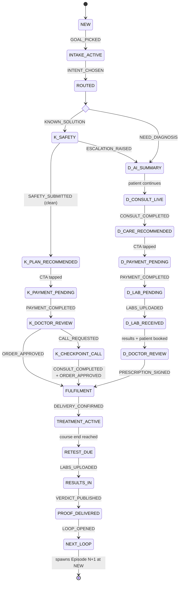

# The Valeo State Machine v1

The EMR is not screens. Every patient is simply in a state; every screen exists
because the patient entered that state; every action emits an event that moves
the state. This document is the single source of truth for those states.

**The rule every state must satisfy** (the four questions):

1. What does the patient see?
2. What does the clinician see?
3. What data becomes available?
4. What event moves it to the next state?

**The stage rule** (entry and exit conditions): a stage cannot be entered until
its entry conditions are true, and cannot be left until its exit conditions are
true. Both are listed for every state, with the function that enforces them and
a plain-language line of what actually happens.

**The dated-exit rule** (from the journey diagram): every state exits into a
dated, scheduled next event. Nothing exits into "we'll be in touch."

---

## 1. The five objects

Five entities. Not hundreds. Plus Order, which is money and therefore its own
thing.

### 1.1 Patient — permanent, never changes

```
Patient {
  id
  name
  age
  gender            male | female
  country
  contact           phone, email, address
  medical_history   conditions, allergies, surgeries
  current_medications
  insurance
}
```

One row per human. Goals do NOT live here: a goal is a reason for coming,
and a reason for coming is an Episode. (In today's prototype: `USER` +
`st.qa.sex/height/weight`.)

### 1.2 Episode — one reason this patient came

```
Episode {
  id
  patient_id
  category          weight | male_hormones | hair | skin | longevity | postpartum
  intent            KNOWN_SOLUTION | NEED_DIAGNOSIS      ← set at the fork
  escalated         bool                                 ← safety screen rewrote the intent
  state             ← §3, the state machine
  clinician_id      the lead this episode is assigned to
  wants             what the patient asked for (KNOWN_SOLUTION only)
  recommended_program_id
  order_id
  opened_at, closed_at
  next_episode_id   ← loop N+1 points at the episode it spawned
}
```

A patient can hold many episodes at once (Weight + Hair + Testosterone), each
in its own state. (In today's prototype: `st.runs[pKey]` + `st.qa.door`.)

### 1.3 JourneyState — the machine itself

Just the enum and the transition table in §3. The UI is
`switch (episode.state) { show this page }` and nothing else.

### 1.4 ClinicalRecord — everything Jamie writes, everything measured

```
ClinicalRecord {
  episode_id
  entries [
    { type: intake_answers | safety_screen | ai_summary | transcript |
            soap_note | assessment | recommendation | prescription |
            lab_order | lab_result | photo | message | adherence_log |
            review_note | verdict
      author:  patient | ai | clinician | nurse | lab | pharmacy | system
      at:      timestamp
      payload: ... }
  ]
}
```

Append-only. Nothing is ever edited or deleted; corrections are new entries.
Authorship is load-bearing: an `assessment` may only be authored by
`clinician`, an `ai_summary` only by `ai`.

### 1.5 Program — commercial, separate from clinical data

```
Program {
  id
  name              patient-facing: "Male Performance Program", "GLP-1 Monthly Plan"
  kind              PROGRAM_12W | MONTHLY_PLAN
  price, currency, billing        one payment | monthly
  duration_weeks
  includes []       doctor, labs, medication, coach, follow_ups, cgm, ...
  protocol_key      internal only, never patient-facing
}
```

The recommendation simply links: Episode → recommended Program → purchased
Program. (In today's prototype: `carePlan(pKey)` = PROGRAM_12W,
`knownPlan(pKey)` = MONTHLY_PLAN.)

### 1.6 Order — the money object

```
Order {
  id, episode_id, program_id
  amount, currency
  status            PENDING | PAID | REFUNDED
  paid_at
  renews            bool (MONTHLY_PLAN)
}
```

---

## 2. Actors and the events they may emit

| Actor | Emits |
|---|---|
| Patient | GOAL_PICKED, INTAKE_SUBMITTED, INTENT_CHOSEN, SAFETY_SUBMITTED, CONSULT_JOINED, PAYMENT_COMPLETED, SLOT_PICKED, DOSE_LOGGED, MESSAGE_SENT |
| AI | AI_SUMMARY_GENERATED, ROUTING_EVALUATED, ESCALATION_RAISED |
| Clinician (Jamie) | CONSULT_COMPLETED, RECOMMENDATION_PUBLISHED, ORDER_APPROVED, CALL_REQUESTED, RESULTS_REVIEWED, PRESCRIPTION_SIGNED, VERDICT_PUBLISHED |
| Nurse | SAMPLE_COLLECTED, DELIVERY_CONFIRMED |
| Lab | LABS_UPLOADED |
| Pharmacy | MEDICATION_DISPENSED, SHIPMENT_OUT |
| System | EPISODE_CREATED, ORDER_CREATED, REMINDER_DUE, RETEST_DUE, LOOP_OPENED |

Events are facts, not requests. Every event is appended to an event log with
`{episode_id, type, actor, at, payload}`; state is a pure function of the
event history.

---

## 3. The state machine



Intent labels, fixed: **KNOWN_SOLUTION** ("I want to start GLP-1 treatment")
and **NEED_DIAGNOSIS** ("I'm not sure what's right for me"). In the prototype
code these are `door: 'known'` and `door: 'resolve'`; a rename to these labels
is part of adopting this spec. Same disease, different intent, different
machine, until both merge at FULFILMENT.

---

### The shared trunk

#### S0 · NEW

- **Entry**: patient exists; no open episode in this category.
  `createEpisode(patientId, category)` fires on goal tap. In plain words: the
  moment he taps "Lose weight" on the greeting, an episode opens.
- **Patient sees**: greeting screen with goal chips. *(Screen: `Between.jsx`)*
- **Clinician sees**: nothing. The episode is not yet real work.
- **Data created**: Episode row `{category, state: NEW, opened_at}`.
- **Exit**: event `GOAL_PICKED` → INTAKE_ACTIVE. Condition: a category chosen.

#### S1 · INTAKE_ACTIVE

- **Entry**: episode exists. `startIntake(episodeId)`. In plain words: the chat
  opens with his goal as his own first message.
- **Patient sees**: the intake chat — sub-goal, sex, height, weight.
  *(Screen: `Coach.jsx`)*
- **Clinician sees**: nothing yet.
- **Data created**: ClinicalRecord entry `intake_answers` (author: patient),
  appended answer by answer.
- **Exit**: event `INTENT_CHOSEN` at the fork question ("What brings you to
  Valeo today?"). Condition: all intake answers present AND intent captured.
  `submitIntake(episodeId, answers)` + `routeIntent(episodeId, intent)`.

#### S2 · ROUTED

- **Entry**: intent recorded on the episode. Zero-duration state: routing is a
  fact, not a screen — the patient never sees an architecture.
- **Exit**: automatic. KNOWN_SOLUTION → K1. NEED_DIAGNOSIS → D1.

---

### The KNOWN_SOLUTION branch — execute safely, minimum friction

#### K1 · SAFETY_SCREEN

- **Entry**: intent = KNOWN_SOLUTION. `startSafetyScreen(episodeId)`. In plain
  words: three more chat questions — what he wants, prior use, red flags.
- **Patient sees**: wants / prior / flags questions in the same chat.
  *(Screen: `Coach.jsx`, KNOWN block)*
- **Clinician sees**: nothing yet. The screen is rule-based, not judgment.
- **Data created**: ClinicalRecord `safety_screen` (author: patient);
  `episode.wants` set.
- **Exit, clean**: event `SAFETY_SUBMITTED` with no flags → K2.
- **Exit, escalated**: any red flag, or "used it before, it didn't work" →
  AI emits `ESCALATION_RAISED`, `episode.escalated = true`, intent is
  rewritten to NEED_DIAGNOSIS, → D1. In plain words: the disguised resolver
  is caught and handed to a doctor, phrased as an upgrade, never a rejection.
  `escalate(episodeId, reason)`.

#### K2 · PLAN_RECOMMENDED

- **Entry**: safety screen passed. `recommendPlan(episodeId)` resolves
  `episode.wants` → a MONTHLY_PLAN program and links it as
  `recommended_program_id`.
- **Patient sees**: the simple monthly plan — doctor review today, medication
  monthly, check-in monthly, message any time, no blood test to start.
  *(Screen: `Buy.jsx`, known branch — "GLP-1 Monthly Plan, SAR 1,349 a month")*
- **Clinician sees**: locked. Nothing to do yet.
- **Data created**: recommendation link (Episode → Program).
- **Exit**: patient taps "Start my plan" → K3. Condition: none beyond the tap.

#### K3 · PAYMENT_PENDING (known)

- **Entry**: CTA tapped. `createOrder(episodeId, programId)` → Order PENDING.
- **Patient sees**: the payment sheet with plan name and monthly fee.
  *(Screen: `PaySheet.jsx`)*
- **Clinician sees**: locked.
- **Data created**: Order row.
- **Exit**: event `PAYMENT_COMPLETED` → `capturePayment(orderId)` → Order PAID
  → K4. Abandoning the sheet stays here; a reminder is scheduled
  (`REMINDER_DUE`), because nothing exits into silence.

#### K4 · DOCTOR_REVIEW (the checkpoint)

- **Entry**: Order PAID. `queueForSignature(episodeId)` — the episode appears
  in the clinician queue **Needs Signature** with intake, safety screen and
  wants attached. In plain words: money is taken, nothing ships until a
  doctor says so, same day.
- **Patient sees**: Today card — "Dr. Layla is reviewing your order. Nothing
  is dispensed until a doctor signs it off. You'll hear back today." No
  button; the wait is the clinic's, not his. *(Screen: `Today.jsx` checkpoint
  card; thread line in `Practice.jsx`)*
- **Clinician sees**: order + full intake + safety answers + prior use; two
  actions: **Approve** / **Request call**.
- **Data created**: ClinicalRecord `review_note` (author: clinician);
  signature on approval.
- **Exit A**: event `ORDER_APPROVED` — `signOrder(episodeId)` → FULFILMENT
  directly. **No lab state exists on this branch.**
- **Exit B**: event `CALL_REQUESTED` → K4a.

#### K4a · CHECKPOINT_CALL

- **Entry**: clinician requested a word. `scheduleCheckpointCall(episodeId)`.
- **Patient sees**: Today card — "Dr. Layla wants two minutes with you before
  confirming" with a **Start the call** button → the live consultation
  surface. *(Screens: `Today.jsx` → `Consultation.jsx`)*
- **Clinician sees**: the same call, with the order and safety answers open.
- **Data created**: ClinicalRecord `transcript` + `soap_note`.
- **Exit**: `CONSULT_COMPLETED` then `ORDER_APPROVED` → FULFILMENT. If the
  call finds a resolver, the clinician converts the episode
  (`convertEpisode(episodeId, NEED_DIAGNOSIS)`) → D3 with the order credited.

---

### The NEED_DIAGNOSIS branch — reduce uncertainty, judgment first

#### D1 · AI_SUMMARY

- **Entry**: intent = NEED_DIAGNOSIS (chosen or escalated).
  `generateAiSummary(episodeId)` — the AI reads the intake and writes the
  three areas worth investigating, each tied to the markers that would settle
  it. In plain words: the AI investigates and reasons; it never diagnoses.
- **Patient sees**: "Here's what's worth investigating" — three rows arriving
  one by one, the boundary line, CTA into the consult.
  *(Screen: `Assess.jsx`)*
- **Clinician sees**: the same summary lands on the clinician dashboard,
  attached to the episode — this is the consult's agenda.
- **Data created**: ClinicalRecord `ai_summary` (author: ai).
- **Exit**: patient continues → D2. Condition: summary generated AND visible
  on the clinician dashboard (the consult must never start without it).

#### D2 · CONSULT_LIVE

- **Entry conditions**: intake answers AND ai_summary are on the clinician
  dashboard; a clinician is live (or the held-callback fallback engaged).
  `startConsult(episodeId, clinicianId)`. In plain words: the doctor can see
  everything the patient shared before either speaks.
- **Patient sees**: meet-the-team, then the live video consultation with
  guided questions while waiting. *(Screens: `Meet.jsx` → `Consultation.jsx`)*
- **Clinician sees**: patient file — intake, ai_summary, guided answers —
  beside the live call.
- **Data created**: ClinicalRecord `transcript` (author: system, uploaded to
  the same dashboard when the call ends) + `soap_note` and `assessment`
  (author: clinician).
- **Exit**: event `CONSULT_COMPLETED`. Conditions: transcript uploaded AND
  assessment written. `completeConsult(episodeId)` → D3.

#### D3 · CARE_RECOMMENDED

- **Entry**: assessment exists. `publishRecommendation(episodeId, programId)`
  — the clinician links a PROGRAM_12W and their first-person reasoning.
- **Patient sees**: "Here's my assessment" — the clinician's own words, the
  recommended programme panel, "View recommended care".
  *(Screen: `Brief.jsx`)*
- **Clinician sees**: locked — their work here is done; queue moves on.
- **Data created**: ClinicalRecord `recommendation`;
  `episode.recommended_program_id`.
- **Exit**: patient opens the plan and taps the CTA → D4.

#### D4 · PAYMENT_PENDING (diagnosis)

- **Entry**: CTA tapped on the 12-week plan screen.
  `createOrder(episodeId, programId)`.
- **Patient sees**: the 12-week care plan — sectioned table, journey sheet,
  "Activate my plan". Then the payment sheet.
  *(Screens: `Buy.jsx` programme branch → `PaySheet.jsx`)*
- **Clinician sees**: locked.
- **Data created**: Order PENDING → PAID.
- **Exit**: `PAYMENT_COMPLETED` → D5. On this branch payment buys the loop,
  and the loop starts with blood.

#### D5 · LAB_PENDING

- **Entry**: Order PAID. `orderLabs(episodeId, panel)` — the panel the
  programme defines. In plain words: step one is the blood test, included.
- **Patient sees**: Today card "Your blood test comes first — choose a time";
  then the booked state with prep list (fasting, water, ID).
  *(Screens: `Today.jsx` bloods cards, `Consult.jsx` slot picker)*
- **Clinician sees**: episode in **Waiting Labs** queue. No action.
- **Data created**: ClinicalRecord `lab_order`; nurse visit slot;
  `SAMPLE_COLLECTED` when the nurse leaves.
- **Exit**: event `LABS_UPLOADED` (actor: lab) → D6. Condition: results file
  attached to the ClinicalRecord.

#### D6 · LAB_RECEIVED → DOCTOR_REVIEW

- **Entry**: results in. `queueForReview(episodeId)` — clinician queue
  **Needs Review**, with the AI trend summary beside the raw panel. Patient
  books the follow-up slot in parallel.
- **Patient sees**: "We're waiting on your lab results" → follow-up booked
  card. Never the raw numbers first: results reach the doctor before the
  patient, by design.
- **Clinician sees**: blood report, AI summary, trends, prescription panel.
- **Data created**: ClinicalRecord `lab_result`, then `prescription`
  (author: clinician) at the follow-up consult.
- **Exit**: event `PRESCRIPTION_SIGNED` — `signPrescription(episodeId)` →
  FULFILMENT. Conditions: results reviewed with the patient AND treatment
  confirmed against them.

---

### The shared room — identical from here

#### M1 · FULFILMENT

- **Entry**: a signed order (K-branch) or a signed prescription (D-branch).
  `dispenseOrder(orderId)` → pharmacy. In plain words: only now does
  medication exist for this patient.
- **Patient sees**: fulfilment strip — confirmed → preparing → out for
  delivery → delivered; nurse hands it over and stays for the first dose.
  *(Screen: `Today.jsx` fulfilment card, thread updates per substate)*
- **Clinician sees**: episode in **Waiting Patient**; no action.
- **Data created**: shipment events (`MEDICATION_DISPENSED`, `SHIPMENT_OUT`,
  `DELIVERY_CONFIRMED`, actor: pharmacy/nurse).
- **Exit**: `DELIVERY_CONFIRMED` + patient starts day 1 → TREATMENT_ACTIVE.

#### M2 · TREATMENT_ACTIVE — the Today screen

- **Entry**: first dose taken. `startTreatment(episodeId)` sets day 1 of the
  programme's duration.
- **Patient sees**: Today — the daily log, adherence, check-ins, the practice
  thread, scheduled follow-ups (weeks 4, 8, 12 on the programme; monthly
  check-in on the plan). *(Screens: `Today.jsx` running state, `Practice.jsx`)*
- **Clinician sees**: adherence dashboard; **Follow-up Due** queue fills on
  schedule; silence is a signal (missed logs surface the episode).
- **Data created**: ClinicalRecord `adherence_log`, `message` entries;
  follow-up `soap_note`s.
- **Exit**: the course end reached (12 weeks programme / rolling monthly).
  Event `RETEST_DUE` (actor: system, scheduled the day treatment started —
  the dated exit was booked before the treatment began).

> **… twelve weeks pass …** — logged as events (`DOSE_LOGGED`,
> `CHECKIN_DONE`, `FOLLOWUP_COMPLETED` ×3), not as states. The machine holds
> at TREATMENT_ACTIVE for the whole course; this spec deliberately does not
> model the interior weeks.

---

### Post-course — week 12 to 16, closing the loop

#### P1 · RETEST_DUE

- **Entry**: course complete. The retest was scheduled at treatment start;
  now it is due. `bookRetest(episodeId)` if the held date needs moving.
- **Patient sees**: "Retest due — the numbers decide" card; nurse slot held.
- **Clinician sees**: episode in **Retest Due** queue.
- **Data created**: second `lab_order`.
- **Exit**: `SAMPLE_COLLECTED` → `LABS_UPLOADED` → P2.

#### P2 · RESULTS_IN

- **Entry**: retest results attached. Results reach the doctor first;
  baseline is locked for comparison. `queueForVerdict(episodeId)`.
- **Patient sees**: "Your results are with Dr. Layla" — the wait is framed as
  the doctor working, because she is.
- **Clinician sees**: before/after panel, trends, the AI's delta summary.
- **Data created**: ClinicalRecord `lab_result` (retest).
- **Exit**: event `VERDICT_PUBLISHED` → P3.

#### P3 · PROOF_DELIVERED — the hero moment

- **Patient sees**: before and after in his own numbers, and the doctor's
  one-sentence verdict. *(Screens: `Today.jsx` verdict → results surface)*
- **Clinician sees**: episode moves to **Completed**.
- **Data created**: ClinicalRecord `verdict` (author: clinician).
- **Exit**: event `LOOP_OPENED` → P4. Trust is at its peak; the next question
  opens from his own data, with a held retest date already attached.

#### P4 · NEXT_LOOP

- `openNextLoop(episodeId)` creates **Episode N+1** at NEW — the next
  question, the new baseline, the held date — and links it via
  `next_episode_id`. The old episode closes. The machine never ends; it
  hands over.

---

## 4. Jamie's machine — queues, not pages

The clinician UI is one list, filtered by state. Nothing else.

| Queue | Episodes in state | Actions | Event emitted |
|---|---|---|---|
| Needs Signature | K4 DOCTOR_REVIEW | Approve / Request call | ORDER_APPROVED / CALL_REQUESTED |
| Needs Review | D6 LAB_RECEIVED, P2 RESULTS_IN | Open results, write note | RESULTS_REVIEWED |
| Needs Prescription | D6 after review | Sign | PRESCRIPTION_SIGNED |
| Waiting Labs | D5, P1 | none (watch) | — |
| Waiting Patient | K3/D4 payment, M1 fulfilment, unbooked slots | nudge | REMINDER_DUE |
| Follow-up Due | M2 at weeks 4/8/12 or monthly | Complete follow-up | FOLLOWUP_COMPLETED |
| Retest Due | P1 | Confirm retest | — |
| Completed | P3/P4 | Open next loop | LOOP_OPENED |

Consultation surfaces (D2, K4a) are not queues; they are live sessions
launched from a queue item.

---

## 5. Event catalogue

| Event | Actor | From → To | Writes |
|---|---|---|---|
| EPISODE_CREATED | system | — → NEW | Episode |
| GOAL_PICKED | patient | NEW → INTAKE_ACTIVE | episode.category |
| INTAKE_SUBMITTED | patient | (within S1) | intake_answers |
| INTENT_CHOSEN | patient | INTAKE_ACTIVE → ROUTED | episode.intent |
| SAFETY_SUBMITTED | patient | K1 → K2 | safety_screen, episode.wants |
| ESCALATION_RAISED | ai | K1 → D1 | episode.escalated, intent rewrite |
| AI_SUMMARY_GENERATED | ai | (enters D1) | ai_summary |
| CONSULT_COMPLETED | clinician | D2 → D3 / K4a → … | transcript, soap_note, assessment |
| RECOMMENDATION_PUBLISHED | clinician | (enters D3) | recommendation, program link |
| ORDER_CREATED | system | K2→K3 / D3→D4 | Order PENDING |
| PAYMENT_COMPLETED | patient | K3 → K4 / D4 → D5 | Order PAID |
| ORDER_APPROVED | clinician | K4 → M1 | review_note, signature |
| CALL_REQUESTED | clinician | K4 → K4a | review_note |
| LABS_UPLOADED | lab | D5 → D6 / P1 → P2 | lab_result |
| PRESCRIPTION_SIGNED | clinician | D6 → M1 | prescription |
| MEDICATION_DISPENSED / SHIPMENT_OUT | pharmacy | (within M1) | shipment events |
| DELIVERY_CONFIRMED | nurse | M1 → M2 | delivery record |
| DOSE_LOGGED / CHECKIN_DONE / FOLLOWUP_COMPLETED | patient / clinician | (within M2) | adherence_log, soap_note |
| RETEST_DUE | system | M2 → P1 | lab_order (retest) |
| VERDICT_PUBLISHED | clinician | P2 → P3 | verdict |
| LOOP_OPENED | system | P3 → P4 | Episode N+1 |

---

## 6. State → screen map (prototype, today)

| State | Prototype screen | Prototype status (`st.runs[pKey]` / flow) |
|---|---|---|
| NEW | `Between.jsx` | flow `between` |
| INTAKE_ACTIVE | `Coach.jsx` | flow `coach` |
| ROUTED | — (zero-duration) | `qa.door` set |
| K1 SAFETY_SCREEN | `Coach.jsx` KNOWN block | `qa.wants/prior/flags` |
| K2 PLAN_RECOMMENDED | `Buy.jsx` known branch | flow `buy`, door known |
| K3/D4 PAYMENT_PENDING | `PaySheet.jsx` | sheet open |
| K4 DOCTOR_REVIEW | `Today.jsx` checkpoint card | `programme` + checkpoint pending |
| K4a CHECKPOINT_CALL | `Consultation.jsx` | checkpoint call |
| D1 AI_SUMMARY | `Assess.jsx` | flow `assess` |
| D2 CONSULT_LIVE | `Meet.jsx` → `Consultation.jsx` | flow `meet`/`consultation` |
| D3 CARE_RECOMMENDED | `Brief.jsx` | `consulted` |
| D5 LAB_PENDING | `Today.jsx` bloods cards | `programme` → `bloodsBooked` → `bloodsDone` |
| D6 DOCTOR_REVIEW | `Today.jsx` follow-up card | `followup` → `ready` |
| M1 FULFILMENT | `Today.jsx` fulfilment strip | `shipping` (confirmed/preparing/out/delivered) |
| M2 TREATMENT_ACTIVE | `Today.jsx` running | `running` |
| P1 RETEST_DUE | `Today.jsx` verdict card | `verdict` |
| P2 RESULTS_IN | `Today.jsx` reviewing | `reviewing` |
| P3 PROOF_DELIVERED | results surface | `done` |
| P4 NEXT_LOOP | next episode at NEW | — |

The clinician dashboard (§4) does not exist in the prototype yet; it is the
next build surface, and it is a single filtered list.

---

## 7. What this unlocks

Pages stop being designed one by one. Each page is
`current state + current data + allowed actions`, the clinician UI is a queue
filter, the backend is an event log, and any new programme (hair, skin,
recovery) is only: one Program row, one safety-screen list, one lab panel,
one set of authored clinical copy. The machine does not change.
